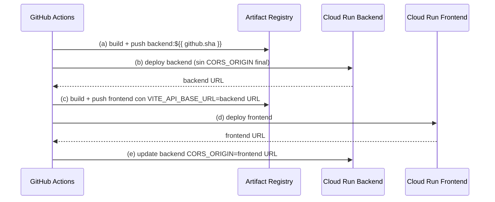

## Context

Incrementa-gestion despliega pre-prod en GCP Cloud Run. La Etapa A entregó Dockerfiles reproducibles; la Etapa B creó la infraestructura GCP (Artifact Registry, Secret Manager, WIF pool/provider, deployer SA, runtime SA). Falta el pipeline CI/CD que conecte push a `preprod` con build, push y deploy automatizado.

**Recursos GCP existentes (solo consumo):**

| Recurso | Valor |
|---------|-------|
| Proyecto | `incrementa-gestion-dev` |
| Región | `us-central1` |
| WIF provider | `projects/1058943943576/locations/global/workloadIdentityPools/github-pool/providers/github-provider` |
| Deployer SA | `incrementa-deploy-sa@incrementa-gestion-dev.iam.gserviceaccount.com` |
| Runtime SA | `incrementa-run-sa@incrementa-gestion-dev.iam.gserviceaccount.com` |
| Artifact Registry | `us-central1-docker.pkg.dev/incrementa-gestion-dev/incrementa` |
| Cloud SQL | `incrementa-gestion-dev:us-central1:incrementa-db` |
| GCS bucket | `incrementa-contratos-dev` |
| Azure tenant | `60322b4a-13bf-4f19-89ae-efe4a54ffed6` |
| Azure client ID | `dc734f4a-5f25-4e88-b728-aab4715f2122` |

**Gotchas conocidos:**

- `config.js` (back/front) solo acepta `ENVIRONMENT` ∈ `{local, dev, prod}` → usar `ENVIRONMENT=dev` en Cloud Run pre-prod.
- En `dev`, backend requiere env vars explícitas para OIDC/Graph (no hay defaults útiles).
- Vite hornea `VITE_*` en build-time → frontend build va **después** del deploy del backend.
- `CORS_ORIGIN` del backend depende de la URL del frontend → update final del servicio backend.

## Goals / Non-Goals

**Goals:**

- Workflow `.github/workflows/deploy-preprod.yml` válido, disparado solo en push a `preprod`.
- Autenticación keyless con WIF (`google-github-actions/auth@v2`).
- Build + push imágenes backend y frontend a Artifact Registry con tag `${{ github.sha }}`.
- Deploy backend con Cloud SQL, secretos SM, runtime SA y env vars documentadas.
- Deploy frontend con build-args Vite usando URL real del backend.
- Update final del backend con `CORS_ORIGIN` = URL del frontend.
- Mensajes de error en español (es-CL) donde aplique en steps del workflow.

**Non-Goals:**

- Crear o modificar recursos GCP (WIF, IAM, AR, SM, Cloud SQL).
- Registrar redirect URI en Azure Entra (Etapa D manual).
- Smoke test post-deploy (Etapa D manual).
- Workflows para otras ramas o producción.
- Cambiar Dockerfiles o lógica de aplicación.

## Decisions

### 1. Trigger y permisos del job

```yaml
on:
  push:
    branches: [preprod]

permissions:
  id-token: write
  contents: read
```

**Rationale:** WIF requiere `id-token: write` para intercambiar OIDC token por credenciales GCP. La restricción repo+rama ya está en el WIF provider; el trigger refuerza el contrato.

### 2. Autenticación: `google-github-actions/auth@v2`

```yaml
- uses: google-github-actions/auth@v2
  with:
    workload_identity_provider: projects/1058943943576/locations/global/workloadIdentityPools/github-pool/providers/github-provider
    service_account: incrementa-deploy-sa@incrementa-gestion-dev.iam.gserviceaccount.com
```

**Alternativa descartada:** JSON key en GitHub Secrets — viola requisito keyless y aumenta superficie de ataque.

### 3. Flujo de 5 pasos (orden por dependencia de URLs)



**Captura de URLs:**

```bash
gcloud run services describe <service> --region us-central1 --format='value(status.url)'
```

**Rationale:** Vite necesita URL del backend en build-time; CORS del backend necesita URL del frontend en runtime. No hay forma de resolver ambas sin un deploy intermedio.

### 4. Tags de imagen

- **Inmutable:** `${{ github.sha }}` — trazabilidad commit ↔ imagen.
- **Móvil (opcional):** `preprod` — conveniencia para referencias humanas.

Formato completo: `us-central1-docker.pkg.dev/incrementa-gestion-dev/incrementa/<service>:${{ github.sha }}`

### 5. Docker auth para Artifact Registry

Tras `auth@v2`, ejecutar:

```bash
gcloud auth configure-docker us-central1-docker.pkg.dev --quiet
```

Luego `docker build`, `docker tag`, `docker push`.

### 6. Deploy backend (Cloud Run)

Servicio sugerido: `incrementa-backend` (o nombre existente si ya creado).

Flags clave:

| Flag | Valor |
|------|-------|
| `--image` | `.../incrementa/backend:${{ github.sha }}` |
| `--service-account` | `incrementa-run-sa@incrementa-gestion-dev.iam.gserviceaccount.com` |
| `--add-cloudsql-instances` | `incrementa-gestion-dev:us-central1:incrementa-db` |
| `--set-secrets` | `DATABASE_URL=DATABASE_URL:latest,GRAPH_CLIENT_SECRET=GRAPH_CLIENT_SECRET:latest,RESEND_API_KEY=RESEND_API_KEY:latest` |
| `--set-env-vars` | Ver tabla abajo |
| `--allow-unauthenticated` | sí |
| `--region` | `us-central1` |

Env vars (paso b, sin `CORS_ORIGIN`):

```
ENVIRONMENT=dev,
OIDC_ISSUER_URL=https://login.microsoftonline.com/60322b4a-13bf-4f19-89ae-efe4a54ffed6/v2.0,
OIDC_AUDIENCE=dc734f4a-5f25-4e88-b728-aab4715f2122,
GRAPH_TENANT_ID=60322b4a-13bf-4f19-89ae-efe4a54ffed6,
GRAPH_CLIENT_ID=dc734f4a-5f25-4e88-b728-aab4715f2122,
GCS_BUCKET=incrementa-contratos-dev,
RESEND_FROM_EMAIL=onboarding@resend.dev
```

**NO setear:** `PORT` (Cloud Run inyecta 8080), `GOOGLE_APPLICATION_CREDENTIALS`, `PGSSLMODE`, `CORS_ORIGIN` (paso e).

Paso (e) — update solo `CORS_ORIGIN`:

```bash
gcloud run services update incrementa-backend \
  --region us-central1 \
  --update-env-vars CORS_ORIGIN=<frontend-url>
```

### 7. Build + deploy frontend

Build args (paso c):

| Build arg | Valor |
|-----------|-------|
| `VITE_API_BASE_URL` | URL backend del paso (b) |
| `VITE_AZURE_CLIENT_ID` | `dc734f4a-5f25-4e88-b728-aab4715f2122` |
| `VITE_AZURE_AUTHORITY` | `https://login.microsoftonline.com/60322b4a-13bf-4f19-89ae-efe4a54ffed6` |
| `VITE_AZURE_API_SCOPE` | `api://dc734f4a-5f25-4e88-b728-aab4715f2122/access_as_user` |
| `ENVIRONMENT` | `dev` |

Deploy (paso d): `--allow-unauthenticated`, `--region us-central1`, sin Cloud SQL ni secretos.

### 8. Estructura del workflow: job único secuencial

Un solo job con steps secuenciales (a→e). **Alternativa descartada:** jobs paralelos — imposible por dependencia de URLs entre servicios.

### 9. Validación del workflow

- `actionlint` o parseo YAML válido (si disponible en CI local).
- Revisión manual de sintaxis `gcloud run deploy` flags.
- No commitear secretos; usar `--set-secrets` con nombres SM.

### 10. Nombres de servicios Cloud Run

Propuesta: `incrementa-backend`, `incrementa-frontend`. Definir como env vars al inicio del workflow para fácil cambio:

```yaml
env:
  GCP_PROJECT: incrementa-gestion-dev
  GCP_REGION: us-central1
  AR_HOST: us-central1-docker.pkg.dev/incrementa-gestion-dev/incrementa
  BACKEND_SERVICE: incrementa-backend
  FRONTEND_SERVICE: incrementa-frontend
```

## Risks / Trade-offs

| Riesgo | Mitigación |
|--------|------------|
| Backend desplegado sin CORS correcto entre pasos (b) y (e) | Ventana breve; paso (e) inmediato tras conocer URL frontend |
| Fallo en paso (e) deja CORS incorrecto | Workflow falla; re-run o update manual de env var |
| `VITE_*` horneadas — cambio de URL backend requiere rebuild frontend | Aceptado; documentado en Etapa A |
| Primer deploy puede fallar si servicios Cloud Run no existen | `gcloud run deploy` crea servicio si no existe (upsert) |
| Logs de gcloud podrían exponer env vars no secretas | No loguear secretos; `--set-secrets` no imprime valores |

## Migration Plan

1. Merge del workflow a rama `preprod` (o PR que lo añade).
2. Verificar que WIF provider permite repo `dhroco/incrementa-gestion` y rama `preprod`.
3. Push a `preprod` dispara el pipeline (Etapa D — manual, fuera de alcance).
4. Post-deploy manual: registrar redirect URI de Entra con URL frontend Cloud Run.
5. Smoke test manual: health check backend, login MSAL frontend.

**Rollback:** Re-deploy imagen anterior por SHA desde Artifact Registry; o revert del commit en `preprod`.

## Open Questions

- Nombres exactos de servicios Cloud Run si ya fueron creados manualmente con otro nombre — usar variables de entorno en el workflow para ajustar sin editar cada step.
- ¿Tag móvil `preprod` además de SHA? — Incluido como opcional; no bloqueante.
